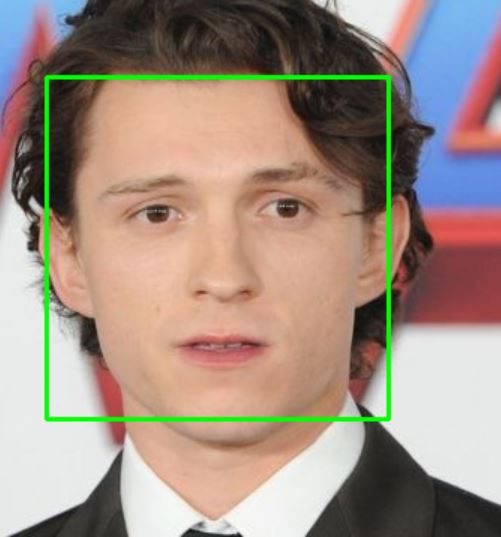

# Face-Detection-App

  

## face_finder.py

Program that detects faces in a given image (change at line 7: image_to_use). Faces that are detected have a green rectangle around them.
This program uses OpenCV's Haar Cascade algorithm.

## face_detector.py

Program that detects faces in real-time, for example with a live video. Faces that are detected have a green rectangle around them.
This program uses OpenCV's Haar Cascade algorithm.
